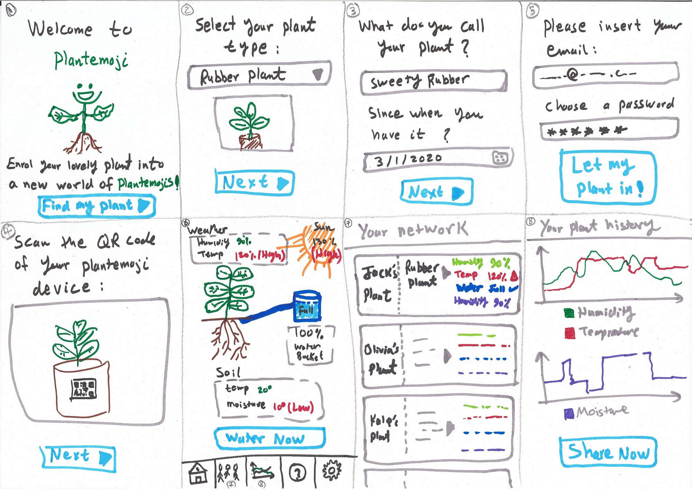
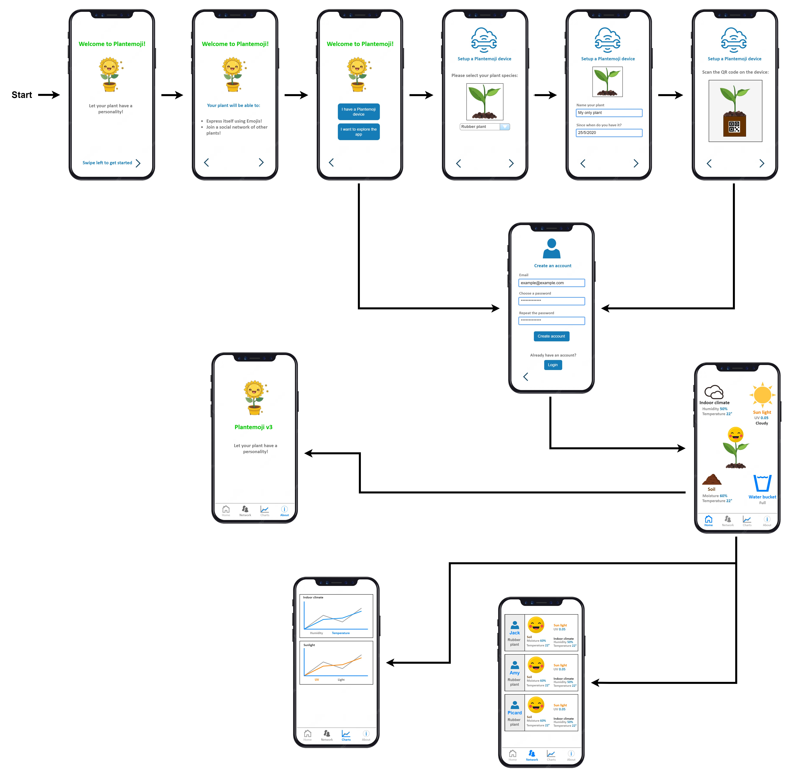

# Plaentemoji app

An app that connects to a previously designed device in CE lab to visualise indoor climate
parameters for plants, namely; air humidity and temperature, soil humidity and temperature,
sunlight, and water storage level. The app reads a QR Code to connect to the physical device, and
allows the user to see other users plant's sensor feed.

## Wireframing journey

Ideation session in  the CE lab:

Wireframes designed via Drow.io:

## Demo:

## How to install

Please follow the following steps:

- You need to run the server contained in the original project repo (InfluxDB): https://github.com/syk-yaman/plantemoji
- Run the Docker image which contains Express.JS API.
- Run`flutter pub get` before running the app
- Run the app

